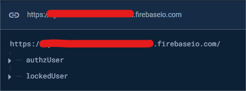

# Projeto Automação de Testes Saucedemo

### Visão Geral

Este projeto automatiza testes para a aplicação Sauce Demo, focando nas funcionalidades de autenticação e gerenciamento de produtos.

## Instalação e Configuração

### Pré-requisitos 

Certifique-se de ter o Node.js instalado. Você pode baixá-lo em [Node.js.](https://nodejs.org/)

### Instalação

1. Clone este repositório e navegue até o diretório do projeto:
```
git clone <URL_DO_REPOSITORIO>
cd <NOME_DO_PROJETO>
```

2. Instale as dependências do projeto executando o seguinte comando:

```
 npm install
```

### Executando os Testes

Antes de executar os testes, crie um arquivo com o nome `.env` na raiz do projeto e adicione à variável `BASE_URL` a base URL da aplicação [Sauce Demo](https://www.saucedemo.com/). Você pode usar o arquivo `.env.example` como referência, ele se encontra na raiz do projeto.

Os usuários do projeto estão configurados no Firebase Realtime Database para evitar hardcoding de dados de homologação no código. 



O projeto esta configurado para acessar o banco de dados via API usando a task cy.task('getUser', 'name_user'). Para acessar o usario basicamente você precisa te-lo criado no Realtime Database e adicionar o ID na variavel `PROJECT_ID` do projeto no arquivo `.env`. O arquivo deve ter o seguinte formato:

Exemplo:

```
BASE_URL=<base url do projeto>
PROJECT_ID=<id do projeto no firebase>
DEVICE_NAME=Dell XPS 15
```

No exemplo acima, há uma variável chamada `DEVICE_NAME` que deve ser configurada com o nome do dispositivo desejado. Por exemplo, se o dispositivo for `Dell XPS 15`, o projeto será executado com um viewport de `1440x900`. Para consultar as dimensões de todos os dispositivos registrados, acesse o arquivo `screen-resolutions.json` na raiz do projeto. Essa configuração proporciona um controle mais preciso sobre as dimensões dos testes. Se necessário, também é possível ajustar o viewport diretamente pela linha de comando usando o comando `npx cypress open --config viewportWidth=1920,viewportHeight=1080`.

Realizando o passo anterior você pode executar os testes do projeto, executando o comando:

```
npm run test
```

## Reportes

O projeto foi desenvolvido com o Allure Report. Caso esteja rodando o projeto localmente, basta executar npm run allure:open, e o relatório com todas as informações da execução recém-realizada será aberto em uma nova aba do seu navegador.


Mas caso esteja visualizado o projeto no github, basta clicar  e Você pode-rá acessar o relatório da última execução da pipe do projeto.

Mas, caso esteja visualizando o projeto no GitHub, basta clicar [aqui](https://juliosantosjob.github.io/Vox-Tecnologia-Technical-Challenge), e você poderá acessar o relatório da última execução da pipeline do projeto.

### Contato

Para mais informações ou dúvidas, você entre em contato comigo :)

 [](https://www.linkedin.com/in/julio-santos-43428019b)
 [](https://www.instagram.com/juli0sts/)
 [](https://www.facebook.com/profile.php?id=100003793058455)
<a href="mailto:julio958214@gmail.com">
  </a> 

